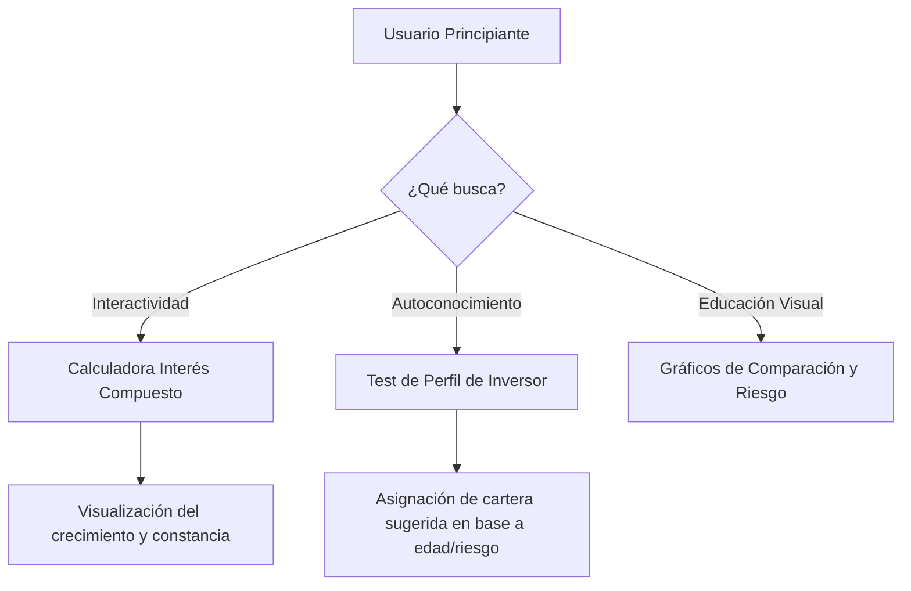

# Auditoría de Contexto y Plan de Mejoras: Aprender a Invertir 📈

Este documento sirve como análisis profundo y guía de ruta para transformar el sitio **Aprender a Invertir** en la plataforma de referencia en educación financiera para principiantes en Argentina. Aquí se identifican los problemas técnicos actuales, deficiencias en SEO, inconsistencias de diseño (UX/UI), y se proponen mejoras de contenido y herramientas interactivas que darán un salto de calidad profesional a la web.

---

## 1. Contexto y Arquitectura Actual del Proyecto

**Aprender a Invertir** es un portal educativo desarrollado con **Astro**, **TailwindCSS** y **React** enfocado en enseñar finanzas a usuarios novatos del mercado argentino. El proyecto cuenta con una amplia variedad de rutas dedicadas a conceptos clave de inversión:

- **Inicio/Landing (`/`)**: Introducción al concepto de inversión y contraste con la realidad argentina (donde solo el 5-10% invierte, comparado con el 50% de EEUU).
- **Historia de la Economía (`/historia-de-la-economía`)**: Evolución histórica del dinero, el trueque y las finanzas.
- **Libertad Financiera (`/libertad-financiera`)**: Concepto de ingresos pasivos, diversificación y acumulación a largo plazo.
- **Bolsa de Valores (`/bolsa-de-valores`)**: Cómo opera la bolsa, mitos urbanos y prevención de estafas (`/bolsa-de-valores/evitemos-estafas`).
- **Perfiles del Inversor (`/perfiles-del-inversor`)**: Clasificación de tolerancia al riesgo y horizonte temporal.
- **Instrumentos Financieros (`/instrumentos-financieros`)**:
  - Renta Fija vs Renta Variable (`/renta-fija-o-renta-variable`).
  - Bonos del Estado (`/instrumentos-financieros/bonos`) y métricas avanzadas como TIR, Paridad y Duration (`/instrumentos-financieros/bonos/tir-paridad-duración`).
  - CEDEARs (`/instrumentos-financieros/cedears`) y ETFs (`/instrumentos-financieros/cedears/etfs`).
  - Cauciones bursátiles (`/instrumentos-financieros/cauciones-bursátiles`).
  - Fondos Comunes de Inversión (`/fondo-común-de-inversion`).
- **Dólar MEP (`/dolar-mep`)**: Mecánica de adquisición legal de divisas vía bonos.
- **Sectores de la Economía de EE.UU. (`/sectores-de-la-economía-de-EEUU`)**.
- **Análisis de Activos**: Análisis Técnico (`/análisis-técnico`) y Análisis Fundamental (`/análisis-fundamental`).
- **Comenzar a Invertir (`/comenzar-a-invertir`)**: Guía de brokers, requisitos de apertura de cuenta y rol de los Bancos Centrales (`/comenzar-a-invertir/bancos-centrales`).

---

## 2. Errores Críticos y Bugs de Estructura (Markup & JS)

Durante el análisis del código fuente, se detectaron fallos de diseño técnico que afectan la semántica de la página, el rendimiento y la usabilidad:

### A. Bug de Maquetación: Layouts Anidados (Duplicidad de HTML/Body)
* **Descripción del problema:** Los componentes de navegación (`Nav.astro` y `Nav2.astro`) importan `Layout.astro` y envuelven su contenido con él:
  ```astro
  <!-- Nav.astro -->
  <Layout title="Nav">
      <nav>...</nav>
  </Layout>
  ```
  Al mismo tiempo, las páginas (como `dolar-mep.astro` o `index.astro`) usan `PageContent.astro` o `Layout.astro` directamente, resultando en que la barra de navegación introduce un segundo par de etiquetas `<html>`, `<head>` y `<body>` dentro del body principal del sitio.
* **Impacto:** Rompe los estándares de maquetación HTML5. Los motores de búsqueda detectan código deformado y la consistencia de estilos de CSS puede romperse aleatoriamente.
* **Solución:** Quitar la envoltura `<Layout>` de `Nav.astro` y `Nav2.astro`. Deben ser elementos `<nav>` limpios y autónomos.

### B. Conflicto con Astro ViewTransitions (JavaScript Inerte)
* **Descripción del problema:** La app usa `<ViewTransitions />` en su cabecera para transiciones suaves sin recargar el navegador. Sin embargo, los scripts de `ThemeIcon.astro` (dark mode) y `Menu.astro` (menú móvil) escuchan el evento clásico `DOMContentLoaded` o corren de manera inline inmediata al cargar el HTML.
* **Impacto:** Cuando el usuario cambia de página usando el menú lateral, la navegación de Astro intercepta la carga, actualiza el DOM, pero **no vuelve a disparar `DOMContentLoaded` ni a registrar los listeners de clic**. Como consecuencia, el botón de Modo Oscuro y el Menú hamburguesa dejan de funcionar por completo al navegar a cualquier subpágina interna.
* **Solución:** Cambiar la escucha de eventos al hook oficial de Astro:
  ```javascript
  document.addEventListener("astro:page-load", () => {
      // Registrar listeners aquí para que se reactiven tras cada cambio de página
  });
  ```

### C. Textos Estáticos Incorrectos y Rutas de Recursos Rotas
* **Tema Oscuro (`ThemeIcon.astro`):** El texto del botón está hardcodeado en `"Ir a Modo Oscuro"`. Si el tema oscuro está activo, debería actualizar dinámicamente a `"Ir a Modo Claro"`.
* **Ruta `/public/...`:** En `Layout.astro`, los enlaces a recursos estáticos usan `/public/finance.svg`. En Astro, el contenido de `public/` se compila a la raíz del directorio de salida (`dist/`). Por lo tanto, el path correcto es `/finance.svg`. Actualmente, el favicon y las imágenes compartidas en redes sociales dan error 404 en producción.

---

## 3. SEO y Visibilidad (Optimización en Motores de Búsqueda)

El SEO es vital para un sitio educativo. El estado actual presenta varios problemas que impiden indexar el sitio correctamente:

### A. Meta-Descripción y Canonical URL Duplicadas
* **Descripción:** `Layout.astro` tiene hardcodeada una única descripción meta:
  ```html
  <meta name="description" content="Descubre cómo invertir y alcanzar tu libertad financiera..." />
  <link rel="canonical" href="https://www.aprenderainvertir.app/" />
  ```
* **Consecuencia:** Todas las páginas de la plataforma compiten entre sí y Google las califica como contenido duplicado, reduciendo su visibilidad. Además, la etiqueta `canonical` estática en la Home le dice a los buscadores que no indexen páginas internas (como `/dolar-mep`), ya que "todas son la misma página".
* **Solución:** Pasar la descripción meta y la URL canónica como `props` a `Layout.astro` para que cada archivo `.astro` defina su propia metadata única.

### B. Placeholders en Open Graph y Redes Sociales
* **Descripción:** Encontramos etiquetas como `<meta property="og:url" content="https://www.tusitioweb.com/" />`.
* **Solución:** Reemplazar por la URL real del proyecto y generar metadatos OG individuales.

### C. Falta de Sitemap Dinámico y Robots.txt
* **Descripción:** Aunque existe una referencia a `sitemap.xml`, no hay una integración instalada ni configurada en `astro.config.mjs`.
* **Solución:** Instalar `@astrojs/sitemap` y configurar un archivo `robots.txt` en el directorio `public/` especificando las reglas de rastreo.

---

## 4. Experiencia de Usuario (UX/UI) y Diseño Premium

Para que el usuario se sienta atraído por la web, el diseño debe verse profesional, moderno e interactivo.



### A. Test del Inversor Interactivo (React)
* **Estado actual:** El test en `/perfiles-del-inversor` es un texto plano inerte que invita a realizar un test en una web externa (InvertirOnline).
* **Propuesta de mejora:** Desarrollar un **formulario interactivo paso a paso** (multistep wizard) en React.
  - El usuario responde preguntas sobre plazo de retiro de fondos, conocimientos previos, y comportamiento ante caídas de mercado (25%).
  - Al finalizar, calcula la puntuación y muestra dinámicamente un diagnóstico detallado: **Conservador**, **Moderado** o **Agresivo**.
  - Muestra un gráfico de torta de la distribución de cartera sugerida (ej. 80% CEDEARs / 20% Cauciones para agresivos).

### B. Calculadora de Interés Compuesto (React)
* **Estado actual:** Falta una herramienta interactiva para que el usuario entienda "el poder del interés compuesto" del que habla Albert Einstein.
* **Propuesta de mejora:** Crear un componente interactivo con inputs deslizantes (sliders) para:
  - Capital Inicial ($ / U$D).
  - Aportes Mensuales periódicos.
  - Tasa de Retorno Anual estimada (ej. 8% para S&P 500, 4% para bonos).
  - Tiempo en Años (5, 10, 20, 30 años).
  - **Output:** Un gráfico de barras o líneas interactivo que contraste la acumulación de efectivo bajo el colchón vs. la inversión con interés compuesto, demostrando empíricamente el crecimiento exponencial de la riqueza.

### C. Refinamiento Estético y Consistencia Visual
* **Colores Curados:** Usar variables HSL consistentes en lugar de estilos ad-hoc.
* **Micro-animaciones:** Añadir efectos hover y transiciones fluidas en tarjetas de herramientas y enlaces de navegación.
* **Optimización en Móviles:** Ajustar el menú móvil y los contenedores de video para evitar desbordamientos en pantallas pequeñas.

---

## 5. Calidad de Información y Rigor Financiero (Foco Argentina)

Para posicionarse como la mejor web de finanzas para principiantes, debemos elevar el nivel de rigurosidad técnica y adaptarlo a la realidad del inversor argentino:

| Concepto | Detalle Actual | Mejora Propuesta (Rigor Profesional) |
| :--- | :--- | :--- |
| **CEDEARs** | Qué son y cómo funcionan. | Explicar el riesgo doble: fluctuación del activo subyacente y fluctuación del tipo de cambio **Dólar CCL**. Explicar el concepto de "ratio de conversión" (ej: Apple es 10:1). |
| **Dólar MEP** | Pasos generales de bonos. | Detallar explícitamente el concepto de **Parking** (tiempo obligatorio de permanencia del bono antes de su venta en dólares, actualmente 1 día hábil). Mencionar restricciones cruzadas (subsidios energéticos, préstamos, etc.). |
| **Cauciones Bursátiles** | Explicación breve. | Comparar directamente con el **Plazo Fijo Bancario**. Explicar por qué son el instrumento más seguro del mercado de valores (con garantía colateral liquidada automáticamente por ByMA). |
| **Riesgo Cambiario** | No se menciona. | Explicar cómo la devaluación del peso afecta a los diferentes instrumentos y por qué el resguardo en dólares (MEP, Obligaciones Negociables, CEDEARs) es clave en Argentina. |
| **Impuestos** | No mencionado. | Incluir una sección básica explicando qué instrumentos están exentos de Bienes Personales y Ganancias en Argentina (plazos fijos, bonos públicos, cauciones) y cuáles no (acciones, CEDEARs, ONs bajo ciertas leyes). |

---

## 6. Plan de Acción y Hoja de Ruta

Para implementar estas optimizaciones, dividimos el desarrollo en tres fases bien definidas:

### Fase 1: Saneamiento Técnico, Estructural y SEO
1. Corregir los archivos de barra de navegación (`Nav.astro` y `Nav2.astro`) para remover la envoltura `<Layout>` redundante.
2. Modificar `ThemeIcon.astro` y `Menu.astro` para implementar el listener `astro:page-load`, garantizando el funcionamiento de la interfaz tras cambiar de ruta.
3. Actualizar `Layout.astro` y `PageContent.astro` para recibir `title`, `description` y `canonicalUrl` dinámicos desde cada página.
4. Reparar los enlaces a recursos estáticos cambiando `/public/` por `/`.

### Fase 2: Herramientas de Interacción (Visuales & Prácticas)
1. Construir e integrar el **Test del Inversor Interactivo** en la página correspondiente, utilizando un modal o flujo React animado.
2. Diseñar la **Calculadora de Interés Compuesto** en la sección de Libertad Financiera, permitiendo simulaciones en tiempo real con gráficos dinámicos interactivos.

### Fase 3: Enriquecimiento Académico y Rigor Financiero
1. Rediseñar y extender la documentación de Dólar MEP, CEDEARs y Cauciones con los detalles regulatorios y tributarios de Argentina.
2. Crear un **Glosario de Términos Bursátiles** interactivo o tarjetas informativas desplegables.
